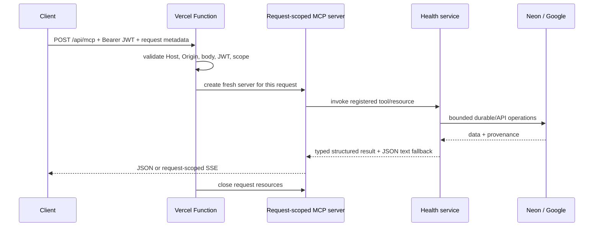

# MCP TypeScript SDK v2 and Google Health MCP hosting research

**Research date:** 2026-07-29
**Decision scope:** MCP protocol/SDK architecture, authorization, Google credential custody, runtime/hosting, compatibility, pricing, and adoption plan for `health.emmetts.dev`
**Decision:** Keep Vercel Node.js Functions with Fluid Compute in `iad1`; migrate in two releases to the official SDK v2 and then stable Better Auth OAuth Provider/JWT plus Google refresh-token DPoP.

## Terminology

“MCP v2” is useful shorthand, but two separately versioned things changed:

1. The Model Context Protocol revision dated **2026-07-28**.
2. The official TypeScript SDK **2.0.0**, now split into focused packages.

The protocol revision changes the wire model. The SDK supplies one implementation. This report names the protocol revision and SDK version explicitly where the distinction matters.

## Executive findings

| Question | Evidence-backed finding | Project decision |
|---|---|---|
| Is the new MCP stateless? | The modern transport removes protocol sessions, initialization state, and `Mcp-Session-Id`; each HTTP POST is self-describing and returns JSON or request-scoped SSE. Application data is not magically stateless. | Build a fresh MCP server per request. Keep durable auth, Google credentials, cache, webhook, update, and audit data. |
| Is SDK v2 serverless/edge portable? | Yes. Its core handler is based on Web `Request`/`Response` and is host-neutral. | Portability is a capability, not the hosting decision. |
| Should this app move to Edge? | No measured benefit defeats the added Node dependency risk and the unavoidable round trips back to Neon/Google. Vercel itself recommends Node over Edge for performance/reliability in new functions. | Explicit Node 24, Fluid Compute, `iad1`, 60-second MCP maximum. |
| Can Google auth replace MCP auth? | No. MCP is an OAuth resource server and must accept only tokens issued for its own resource/audience; it must not accept or transit upstream Google tokens. | Better Auth remains the authorization server. Google Sign-In is identity only. |
| Can Google Health refresh tokens be removed? | No. Unattended Google API access requires securely stored long-lived refresh credentials. | Keep AES-256-GCM encrypted Google tokens and add sender-constraining DPoP. |
| Does JWT eliminate the auth database? | Only on the access-token hot path. DCR clients, rotating refresh tokens, consent, rate limits, signing keys, Google credentials, and audit data remain durable. | Verify one-hour JWTs locally; persist only necessary durable auth state. |
| Are all connectors ready for 2026? | Public documentation does not establish complete adoption across the current connector set. The protocol and SDK explicitly define backward compatibility. | Serve modern 2026 and stateless legacy 2025 concurrently; retain telemetry-gated legacy support. |
| What is the fixed incremental cost? | SDK/provider packages are open source; no new host is needed; Fluid uses existing Vercel metering. | Expected fixed increment `$0`; stop if any deployment operation presents a paid-plan requirement. |

## Protocol architecture: what actually changed

The 2026 transport is per request. Each Streamable HTTP message is an HTTP POST to one endpoint and returns either a JSON object or a request-scoped SSE stream. Protocol version and client capabilities are carried in body `_meta` fields, with selected values mirrored in headers; body/header mismatches must be rejected. Cancellation is closing the response stream. Earlier revisions used connection-scoped sessions and `initialize`; modern compatibility detects the other side's era and falls back when necessary. See the [2026 transport overview](https://modelcontextprotocol.io/specification/2026-07-28/basic/transports), [Streamable HTTP binding](https://modelcontextprotocol.io/specification/2026-07-28/basic/transports/streamable-http), and [key changes](https://modelcontextprotocol.io/specification/2026-07-28/changelog).

### Modern request lifecycle

This removes transport session affinity. It does not remove:

- OAuth client registration, consent, refresh-token rotation, rate limiting, or signing keys.
- Google Health refresh credentials needed after the browser is gone.
- User/account mapping, encrypted cache, webhook delivery records, update inbox, or audit history.
- Explicit application workflows that span calls; those need ordinary durable handles or task infrastructure.

### Discovery and message model

Modern clients probe `server/discover` instead of starting with `initialize`. The server describes current capabilities and supported operations per request. List results no longer vary by connection. The new transport also defines cancellation, header/body metadata reconciliation, cache hints, `resultType`, multi-round-trip state, and new extension surfaces. The project will use discovery, result types, cache hints, and cancellation now; it will not add a durable task or subscription system without a real use case.

## SDK v2 architecture

The official TypeScript SDK 2.0.0 is split instead of shipping every concern through one monolithic package:

- `@modelcontextprotocol/core`: wire schemas and common primitives.
- `@modelcontextprotocol/server`: host-neutral server, handler, auth/resource-server helpers, and Web transport.
- `@modelcontextprotocol/client`: client and conformance plumbing.
- host adapters such as Express are separate.
- legacy authorization-server helpers are frozen separately; the SDK recommends a dedicated OAuth/identity library for an authorization server.

The [v2 migration guide](https://ts.sdk.modelcontextprotocol.io/v2/migration/upgrade-to-v2) documents the package split, request context changes, server factory/handler, schema updates, auth error behavior, legacy compatibility, and 2026 support. Registry checks on 2026-07-29 confirm `@modelcontextprotocol/server` and `@modelcontextprotocol/client` `2.0.0` are the latest stable tags.

### Relevant handler behavior

- `createMcpHandler` is runtime-neutral and exposes a standard Fetch handler.
- A server factory creates an isolated MCP server per request.
- `legacy: "stateless"` allows older initialize/list/call traffic without transport session storage.
- `responseMode: "auto"` selects ordinary JSON when possible and request-scoped SSE when the operation needs streaming.
- Schema preloading can happen once at module initialization, so warm Fluid instances reuse compiled schema work without retaining request state.
- Auth information enters through request context; the SDK does not become the authorization server.

### What gets better here

- No sticky transport session, state adapter, or `Mcp-Session-Id` lifecycle.
- Cleaner deployment to serverless functions and other Fetch-compatible runtimes.
- Deterministic typed input/output contracts and first-class structured content.
- Explicit annotations, result types, cache policy, discovery, and cancellation.
- Smaller conceptual boundary: official transport runtime plus a dedicated OAuth provider.
- Warm-instance schema reuse without request data leaking across invocations.

### What does not get better automatically

- Database/API latency, Google sync latency, connector rollout, and browser OAuth UX.
- Authorization correctness; Host/Origin validation; request-size limits; rate limiting; log privacy.
- Upstream token custody or encryption.
- Durable jobs, cross-instance pub/sub, or server-initiated conversations.
- Accurate tool annotations/output schemas; the application must define them.
- Compatibility with a client that has not adopted the modern protocol unless the server keeps fallback support.

## Project MCP surface migration

The public contract stays stable:

- canonical URL: `https://health.emmetts.dev/api/mcp`
- every current tool name and resource URI
- every argument meaning and unit
- the current JSON string in `content[].text`
- the custom application-level `ping` tool

The implementation adds:

- `z.object(...)` inputs rather than deprecated raw shape overloads.
- exact output schemas and matching `structuredContent`.
- full annotations: read-only, destructive, idempotent, and open-world hints.
- deterministic registration order.
- private cache hints: one hour for discovery/list, 24 hours for static registry/freshness definitions, one hour for profile/settings, zero for connected-user/update-inbox state.
- request telemetry limited to protocol era, method/tool name, duration, status, and cold/warm marker.

It does not add Tasks, MRTR, or `subscriptions/listen`. Reevaluation triggers are a sustained operation beyond the 60-second route budget, a concrete client requirement for listening subscriptions, or a durable task queue becoming necessary.

## Authorization architecture

The [2026 MCP authorization specification](https://modelcontextprotocol.io/specification/2026-07-28/basic/authorization) keeps the standard OAuth role separation:

- the MCP endpoint is the protected resource/resource server;
- the MCP client is an OAuth client;
- Better Auth is the authorization server;
- Google Sign-In is an upstream identity provider used during Better Auth login;
- Google Health OAuth is a different upstream authorization grant for a different audience and scope set.

The MCP resource server must verify that access tokens were issued specifically for its canonical resource. It must not accept or forward other tokens. Therefore, a Google identity/access token cannot become the MCP bearer, even though both flows use the same Google OAuth client configuration.

### Stable provider choice

Registry checks on 2026-07-29 show `better-auth` and `@better-auth/oauth-provider` **1.6.25** as the latest stable releases; 1.7 remains beta/RC. The stable [OAuth Provider documentation](https://better-auth.com/docs/plugins/oauth-provider) provides:

- OAuth/OIDC metadata and endpoints.
- JWT access tokens for resource audiences via the JWT plugin.
- public and confidential DCR, including unauthenticated public registration for MCP clients.
- OAuth 2.1 PKCE-by-default behavior.
- required consent flow, UserInfo, revocation, scopes, claims, and token customization.
- hashed secrets/tokens and storage/rate-limit options.
- configurable expirations; access tokens default to one hour.

The provider does not yet give a production-stable CIMD path on the chosen line. The 2026 spec recommends CIMD and retains DCR for backward compatibility. This project keeps DCR rather than implementing a security-sensitive prerelease protocol by hand.

### Token/storage decision

| State | Stored? | Reason |
|---|---|---|
| MCP access JWT value | No | Signature/issuer/audience/expiry/scope/subject/email verified locally. |
| MCP refresh token | Hash only | Rotation/replay and 60-day offline continuity need durable lineage. |
| MCP client registration | Yes | Redirects, client type, PKCE, and connector identity. |
| Consent | Yes | Auditable user grant and scope selection. |
| Rate-limit state | Yes | Global limits must work across Fluid instances. |
| RS256 signing key | Encrypted persisted private material | Warm/cold instances and deployments must publish one stable JWKS per environment. |
| Google Health refresh token | AES-256-GCM encrypted | Required for unattended upstream API refresh. |

Access JWTs last one hour and use the exact issuer `https://health.emmetts.dev` and audience `https://health.emmetts.dev/api/mcp`. Claims include the verified email. Every request verifies signature, issuer, audience, expiry, required scope, subject, and current `ALLOWED_GOOGLE_EMAILS` membership without a Neon token lookup.

Scopes are `openid`, `profile`, `email`, `offline_access`, `health:read`, and `health:write`. Initial connector challenge requests both health scopes for backward connector ergonomics. The server centrally requires write scope for nutrition/hydration/measurement mutation, update/delete, and acknowledgement operations. A wrong scope gets the MCP-required 403 challenge rather than a generic tool error.

### Revocation tradeoff

Environment allowlist removal remains an immediate account-wide block because every request checks the local current configuration. Client-specific revocation can leave an already issued JWT usable for at most its one-hour lifetime. Emergency signing-key rotation invalidates all outstanding access JWTs. This is an explicit bounded tradeoff for eliminating the per-request database token lookup.

## Google Health credential custody and DPoP

Google's [OAuth web-server documentation](https://developers.google.com/identity/protocols/oauth2/web-server) and [token-security best practices](https://developers.google.com/identity/protocols/oauth2/resources/best-practices) state that refresh tokens must be stored securely and document DPoP sender-constraining for refresh tokens. Google access tokens remain ordinary Bearer tokens even when the refresh token is DPoP-bound.

Per connection, the server will:

1. Generate a P-256/ES256 key pair.
2. Encrypt the private JWK with the existing AES-256-GCM helper under a new HKDF context.
3. Store only public JWK, JWK thumbprint, and latest Google nonce in plaintext.
4. Sign every token exchange/refresh proof with `typ=dpop+jwt`, public `jwk`, unique `jti`, current `iat`, `htm=POST`, exact `htu=https://oauth2.googleapis.com/token`, and cached `nonce` when available.
5. On `use_dpop_nonce`, persist the returned `DPoP-Nonce` and retry exactly once with a fresh proof.
6. Keep Google API calls as Bearer access-token calls.

For an authorization-code exchange, Google's documentation requires the DPoP `jti` to be the base64url SHA-256 of the authorization code; refresh exchanges use a fresh per-request identifier. A successful DPoP exchange returns a refresh token bound to the key and may return a nonce for future requests.

The migration never converts an existing refresh token in place. One explicit `prompt=consent` flow obtains a replacement. The previous encrypted credential remains active until the new token and key record are successfully exchanged and committed atomically. If the Health-specific grant rejects the documented flow, the DPoP stage stops and preserves the working token.

## Runtime and hosting comparison

| Option | Strengths | Costs/risks for this app | Verdict |
|---|---|---|---|
| Vercel Node 24 + Fluid, `iad1` | Full Node/npm compatibility; same Next app/auth/UI; optimized concurrency; active-CPU model; request streaming; existing deploy/rollback; colocated with Neon | Metered existing compute; warm-instance isolation still matters; no durable in-memory state | **Selected** |
| Vercel Edge | Fast isolate start and global placement | Vercel recommends Node for improved performance/reliability; restricted Node APIs/dependencies; every useful request still returns to US-East Neon/Google; no unique SSE benefit | Rejected now |
| Cloudflare Workers | Global Workers platform and mature Durable Objects/Agents ecosystem; official remote MCP examples | Auth/crypto/database integration rewrite; data remains regional unless replatformed; adds provider/deploy/observability surface | Reevaluate only with edge-native durable state |
| Railway container | Long-running process, easy worker/background model, FastMCP viable | At least a `$5/month` Hobby production baseline plus migration; no advantage for a request-scoped MCP hot path | Rejected now |
| Split edge gateway + regional core | Potential global auth/routing front door | Extra network hop, two deployables/trust boundaries, little single-user payoff | Rejected |

Vercel's [Edge runtime documentation](https://vercel.com/docs/functions/runtimes/edge) explicitly recommends migrating from Edge to Node for performance and reliability; Edge still offers only a subset of Node APIs. [Fluid Compute](https://vercel.com/docs/fluid-compute) prioritizes reuse, concurrency, bytecode caching, and active CPU while permitting `maxDuration` and region overrides. [Function pricing](https://vercel.com/docs/functions/usage-and-pricing) is metered by active CPU, provisioned memory, and invocation count; `iad1` is among the lower-cost listed US regions. Railway's [pricing](https://docs.railway.com/pricing) lists Free for experimentation and a `$5/month` Hobby subscription for personal production projects.

### Vercel configuration

- `engines.node = "24.x"` in `package.json`.
- `runtime = "nodejs"`, `preferredRegion = "iad1"`, `maxDuration = 60` on the MCP route.
- Fluid Compute retained/enabled at project level; Vercel function settings remain metered within the existing account.
- Neon pooled connection at runtime, unpooled connection for migrations.
- no `runtime = "edge"`, no resident session/global user state, and no work after response unless explicitly durable.

## HTTP and security boundary

The official SDK handler does not replace the application's HTTP perimeter. `/api/mcp` will additionally enforce:

- exact production, active preview, and explicit localhost Host/Origin policy;
- absent Origin allowed for server-to-server MCP clients;
- 256 KiB MCP JSON body limit before parsing;
- content type/method and mirrored metadata consistency;
- `Cache-Control: private, no-store` on health-bearing responses;
- 401 with canonical protected-resource metadata for missing/invalid JWT;
- 403 with required scope for insufficient scope;
- no Authorization/token/code/DPoP/health argument/result logging.

GET/DELETE without a supported legacy stream/session return 405. Modern traffic uses POST. Legacy fallback remains stateless and never restores server-side session storage.

## Compatibility and migration

### Checkpoint 0.2.1

- SDK v2, contract enhancements, modern/legacy transport, cache hints, safe telemetry, Node 24/Fluid/`iad1`.
- Legacy Better Auth bridge and current endpoint metadata remain in place.
- Production must pass a v2 client and every active connector before the next checkpoint.

### Checkpoint 0.3.0

- Additive provider and DPoP tables first.
- Stable OAuth Provider/JWT, new consent UI, Google DPoP, and CDN typography.
- One connector reauthorization because auth endpoints/scopes change.
- One Google Health prompt-consent flow for the DPoP-bound replacement.
- Legacy tables untouched for a seven-day rollback window.

Legacy protocol support remains until every active connector produces zero legacy requests for 30 consecutive days. Legacy OAuth tables are different: they may be removed after every connector passes and the seven-day rollback window closes, because the new provider uses distinct physical tables.

## Pricing

- **Expected new fixed monthly cost:** `$0`.
- SDK v2 and Better Auth OAuth Provider: open-source dependencies.
- Vercel: existing metered Fluid Function usage; no new service. Current exact account tier/quotas are not exposed by the connector, so deployment must stop on any paid-plan prompt.
- Neon: a handful of small additive rows/tables. No paid branch will be created. A local/available free-branch rehearsal is sufficient.
- Railway: not selected; current production Hobby baseline would add at least `$5/month` before resource overage.
- Cloudflare: not selected, so no new account/service cost.

## Known gaps and reevaluation triggers

| Gap/deferred capability | Why deferred | Trigger to revisit |
|---|---|---|
| CIMD | Stable provider line does not yet make it production-ready; DCR is permitted compatibility | Stable Better Auth 1.7+ support and connector adoption |
| MCP Tasks/MRTR | Current operations are bounded under the function budget | Sustained >60-second work or durable queue requirement |
| `subscriptions/listen` | Multi-instance delivery needs durable pub/sub and client demand | Named client requirement plus chosen durable bus |
| Remove legacy protocol | Connector adoption unknown | Zero legacy traffic from every active connector for 30 days |
| Edge/Workers | Durable dependencies are regional and Node-oriented | State becomes edge-native or measured Node cost/latency loses |
| Railway/FastMCP | No current long-running/session advantage | Resident background workload, cost, or team-standard need becomes material |

## Final conclusion

The best long-term architecture for this application is not “everything stateless” or “move to Edge.” It is a request-scoped, sessionless MCP resource server whose access JWT is locally verifiable, backed by the minimum durable state required for authorization, Google refresh continuity, privacy, and audit. Vercel Node.js Functions with Fluid Compute in `iad1` implement that architecture with the lowest migration surface and best data locality today. The staged release plan turns remaining connector and Google DPoP uncertainty into explicit executable gates instead of assumptions.
